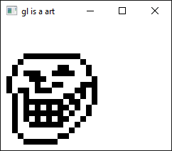

<!--
© 2024 Carl Åstholm
SPDX-License-Identifier: MIT
-->

# Zig example projects

This is my collection of example projects showcasing the Zig language, build system and ecosystem.

- [Breakout](#breakout)
- [Snake](#snake)
- [OpenGL (zigglgen + SDL)](#opengl-zigglgen--sdl)
- [OpenGL (zigglgen + GLFW)](#opengl-zigglgen--glfw)
- [C/C++/Zig](#cczig)

## [Breakout](breakout)

Simple Breakout clone using SDL3 for video, audio, input, etc. How quickly can you break all the bricks?


## [Snake](snake)

[SDL's own example Snake game](https://examples.libsdl.org/SDL3/demo/01-snake/), written in C, built using the Zig build system.


## [OpenGL (zigglgen + SDL)](opengl-sdl)

Creates a window using SDL3 and uses OpenGL bindings generated by [zigglgen](https://github.com/castholm/zigglgen) to draw to it.


## [OpenGL (zigglgen + GLFW)](opengl-glfw)

Look ma, no shaders! Creates a window using GLFW and uses OpenGL bindings generated by [zigglgen](https://github.com/castholm/zigglgen) to draw to it.



## [C/C++/Zig](c-cpp-zig)

Demonstrates how to compile a program consisting of a mix of C, C++ and Zig code.

```
Entered main.c
Hello from C!
Hello from C++!
Hello from Zig!
Leaving main.c
```
