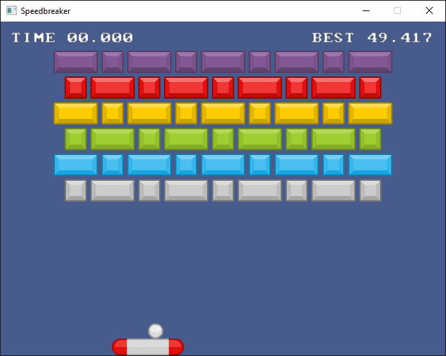

<!--
© 2024 Carl Åstholm
SPDX-License-Identifier: MIT
-->

# Breakout

Simple Breakout clone using SDL3 for video, audio, input, etc. How quickly can you break all the bricks?

Uses [castholm/SDL](https://github.com/castholm/SDL) to build SDL3 from source.



## Controls

### Mouse/keyboard

- Left mouse button: Lock the mouse to the game window
- Mouse, arrow keys: Move the paddle
- Left shift: Hold to slow the paddle movement
- Left mouse button, space: Launch the ball
- R: Restart
- Esc: Unlock the mouse

### Gamepad

- D-pad, left stick: Move the paddle
- LB, RB, LT, RT: Hold to slow the paddle movement
- A, B: Launch the ball
- Start, back: Restart

## Building

Requires Zig 0.14.0 or 0.15.0-dev (master).

```sh
# Run the game
zig build run

# Cross-compile for Windows
zig build -Dtarget=x86_64-windows-gnu -Doptimize=ReleaseFast

# Cross-compile for Linux
zig build -Dtarget=x86_64-linux-gnu -Doptimize=ReleaseFast

# Build for the Web (requires Emscripten)
embuilder build sysroot
zig build -Dtarget=wasm32-emscripten-none -Doptimize=ReleaseFast --sysroot "$(em-config CACHE)/sysroot"
```

## Additional credits

- Sprites: [Puzzle Pack 1.0](https://www.kenney.nl/assets/puzzle-pack) by [Kenney](https://www.kenney.nl/), licensed under [CC0](https://creativecommons.org/publicdomain/zero/1.0/)
- Sounds: [Interface Sounds 1.0](https://www.kenney.nl/assets/interface-sounds) by [Kenney](https://www.kenney.nl/), licensed under [CC0](https://creativecommons.org/publicdomain/zero/1.0/)
