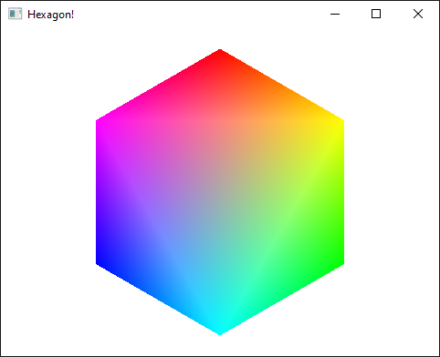

<!--
SPDX-FileCopyrightText: NONE
SPDX-License-Identifier: CC0-1.0
-->

# OpenGL hexagon

Draws a colorful hexagon to the screen using SDL3 and OpenGL.

Uses [castholm/SDL](https://github.com/castholm/SDL) to build SDL3 from source and [zigglgen](https://github.com/castholm/zigglgen) to generate OpenGL bindings.



## Building

Requires Zig 0.14.0 or 0.15.0-dev (master).

```sh
# Run the game
zig build run

# Cross-compile for Windows
zig build -Dtarget=x86_64-windows-gnu -Doptimize=ReleaseFast

# Cross-compile for Linux
zig build -Dtarget=x86_64-linux-gnu -Doptimize=ReleaseFast

# Build for the Web (requires Emscripten)
embuilder build sysroot
zig build -Dtarget=wasm32-emscripten -Doptimize=ReleaseFast --sysroot "$(em-config CACHE)/sysroot"
```
