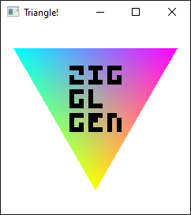

<!--
SPDX-FileCopyrightText: NONE
SPDX-License-Identifier: CC0-1.0
-->

# OpenGL (SDL)

Creates a window using SDL3, then draws to it using OpenGL bindings generated by [zigglgen](https://github.com/castholm/zigglgen).

Uses the [castholm/SDL](https://github.com/castholm/SDL) Zig package, which builds SDL3 from source using the Zig build system.



## Building

Requires Zig `0.14.0` or `0.15.0-dev` (master).

```sh
zig build run
```
