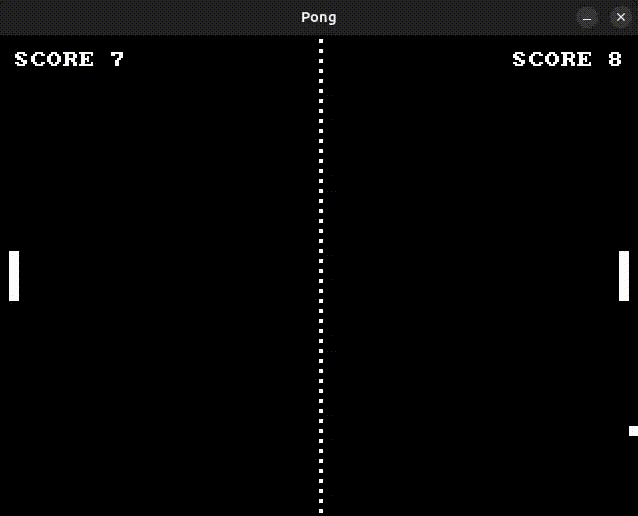

<!--
© 2025 Daniel Alves
SPDX-License-Identifier: CC0-1.0
-->

# Pong

Simple Pong clone using SDL3 for video and input.

Uses the [castholm/SDL](https://github.com/castholm/SDL) Zig package, which builds SDL3 from source using the Zig build system.



## Controls

### keyboard

- Paddle one: W and S for up and down, respectively.
- Paddle two: O and K for up and down, respectively.

## Building

Requires Zig `0.14.0` or `0.15.0-dev` (master).

```sh
# Run the game
zig build run
